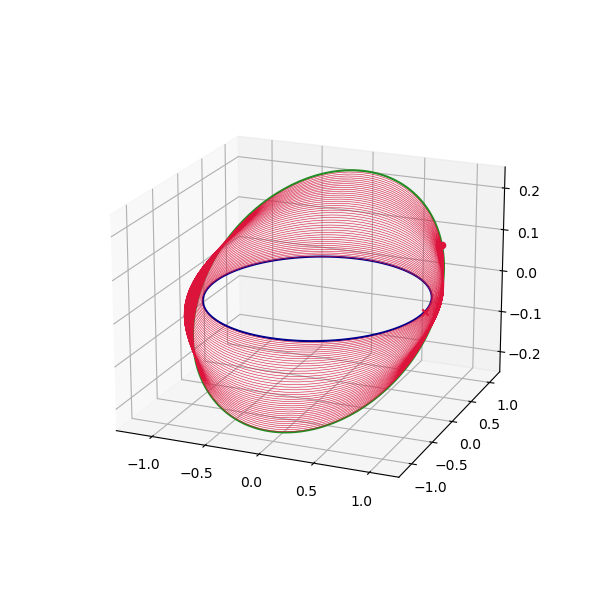

# pyqlaw
Q-law feedback control for low-thrust orbital transfer in Python

| PyPI     | Documentation | Test          | Coverage |
| -------- | ------------- | ------------- | -------- |
| [](https://badge.fury.io/py/pyqlaw)  | [](https://yuricst.github.io/pyqlaw/)    |   | [](./htmlcov/index.html) |


## Capabilities:

- Q-law formulated in Keplerian & SMA-MEE (MEE with semilatus rectum replaced by semimajor axis)
- Coasting capabilities with efficiency parameters [3]
- Thrust duty cycles
- Battery level tracking

## Installation

To install, run 

```
pip install pyqlaw
```

and to uninstall

```
pip uninstall pyqlaw
```

The package depends on the following basic python modules:

- `sympy`, `numpy`, `tqdm`, `matplotilb`, `numba`, `scipy`, `spiceypy`


## Overview of Q-law

Q-law is a Lyapunov controller defined in terms of orbital elements, and can be used as a feedback controller to construct suboptimal low-thrust, many-revolution transfers. 
Q-law is very sensitive to the problem (initial & final orbital elements, choice of orbital elements, thruster specs = control authority) as well as its various hyperparamters, which must be chosen carefully. 
In general, the following should be kept in mind:

- For numerical stability, always work with canonical scales.
- Be very careful with initial/final orbits not to contain singular elements (e.g. inclination ~ 0 deg in Keplerian elements representation).
- Q-law is not suitable for high control authority applications (e.g. interplanetary transfer with 0~very few revolutions).
- Taking larger integration time steps `t_step` (or angle steps, if `use_sundman = True`) makes the algorithm ``faster'' (less time until reaching the targeted elements), but may also lead to instability/high jitter once the spacecraft is close to the target; an appropriate value must be found on a problem-to-problem basis.


For more discussions, see for example: 

- Petropoulos, A. E. (2004). Low-thrust orbit transfers using candidate Lyapunov functions with a mechanism for coasting. Collection of Technical Papers - AIAA/AAS Astrodynamics Specialist Conference, 2(August), 748–762. https://doi.org/10.2514/6.2004-5089
- Petropoulos, A. E. (2005). Refinements to the Q-law for low-thrust orbit transfers. AAS/AIAA Space Flight Mechanics Meeting.
- Hatten, N. (2012). A Critical Evaluation of Modern Low-Thrust, Feedback-Driven Spacecraft Control Laws.


### Basic usage

Test files are included in `./tests/`. Here, we present a basic example. Before starting, please note a couple of things:

- Dynamics & spacecraft parameters are given in non-dimensional quantities, scaling `GM = 1.0` (which may be modified, but it is numerically desirable to use this scaling). 
- All angles are defined in radians.
- Due to instability of Gauss's equation and the Lyapunov feedback control law, some of the elements should not be smaller in magnitude than a certain safe-guarding threshold value. This is why some of the starting elements in the following example are not set to 0, but a mild value (e.g. `1e-2`, `1e-3`). 

We start by importing the module

```python
import pyqlaw
```

Construct initial and final Keplrian elements to target, along with weighting

```python
# initial and final elements (always in order: [SMA, ECC, INC, RAAN, AOP, TA])
oe0 = np.array([1.0, 1e-2, 1e-2, 1e-3, 1e-3, 1e-3])
oeT = np.array([1.1, 5e-3, 0.2, 0.0, 0.0])
woe = [1.0, 1.0, 1.0, 1.0, 0.0]
```

Provide spacecraft parameters (max thrust and mass-flow rate), max transfer time, and time-step (note that integration is done using fixed-steps):

```python
# spacecraft parameters
mass0 = 1.0
tmax = 1e-3
mdot = 1e-4
tf_max = 300.0
t_step = 0.1
```

Construct the problem object, then set the problem parameters

```python
prob = pyqlaw.QLaw()
prob.set_problem(oe0, oeT, mass0, tmax, mdot, tf_max, t_step, woe=woe)
prob.pretty()  # print info
```

```
Transfer:
  sma  : 1.0000e+00 -> 1.1000e+00 (weight: 1.00)
  ecc  : 1.0000e-02 -> 5.0000e-03 (weight: 1.00)
  inc  : 1.0000e-02 -> 2.0000e-01 (weight: 1.00)
  raan : 1.0000e-03 -> 0.0000e+00 (weight: 1.00)
  aop  : 1.0000e-03 -> 0.0000e+00 (weight: 0.00)
```

solve the problem

```python
prob.solve()
prob.pretty_results()   # print info
```

```
qlaw:  99%|█████████████████████████████████████████████████████████████████▏| 2970/3000 [03:03<00:01, 16.20it/s]
Target elements successfully reached!
Final state:
  sma  : 1.1000e+00 (error: 1.8297e-05)
  ecc  : 5.0141e-03 (error: 1.4138e-05)
  inc  : 1.9994e-01 (error: 5.7253e-05)
  raan : 4.5828e-04 (error: 4.5828e-04)
  aop  : 1.2206e-01 (error: 1.2206e-01)
```

Some conveninence methods for plotting:

```python
fig1, ax1 = prob.plot_elements_history()
fig2, ax2 = prob.plot_trajectory_3d()
```

<p align="center">
  
</p>


## Reporting issues

If you found a bug in `pyqlaw`, please report it by creating a new issue on [the repository](https://github.com/Yuricst/pyqlaw/). 
Please make sure to include an example the demonstrates the issue. 

## Contributing

If you have an idea for improving the module, please submid an issue with your proposal for enahncement. 


## References

[1] Petropoulos, A. E. (2003). Simple Control Laws for Low-Thrust Orbit Transfers. AAS Astrodynamics Specialists Conference.

[2] Petropoulos, A. E. (2004). Low-thrust orbit transfers using candidate Lyapunov functions with a mechanism for coasting. AIAA/AAS Astrodynamics Specialist Conference, August. https://doi.org/10.2514/6.2004-5089

[3] Petropoulos, A. E. (2005). Refinements to the Q-law for low-thrust orbit transfers. Advances in the Astronautical Sciences, 120(I), 963–982.

[4] Shannon, J. L., Ozimek, M. T., Atchison, J. A., & Hartzell, C. M. (2020). Q-law aided direct trajectory optimization of many-revolution low-thrust transfers. Journal of Spacecraft and Rockets, 57(4), 672–682. https://doi.org/10.2514/1.A34586

[5] Leomanni, M., Bianchini, G., Garulli, A., Quartullo, R., & Scortecci, F. (2021). Optimal Low-Thrust Orbit Transfers Made Easy: A Direct Approach. Journal of Spacecraft and Rockets, 1–11. https://doi.org/10.2514/1.a34949

[6] [Modified Equinoctial Elements (careful with typos in this document!)](https://spsweb.fltops.jpl.nasa.gov/portaldataops/mpg/MPG_Docs/Source%20Docs/EquinoctalElements-modified.pdf)

[7] Hatten, N. (2012). A Critical Evaluation of Modern Low-Thrust, Feedback-Driven Spacecraft Control Laws.
