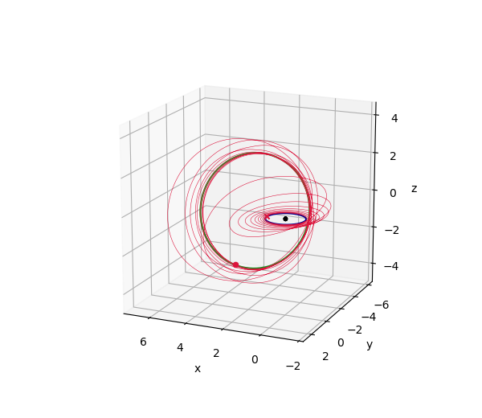
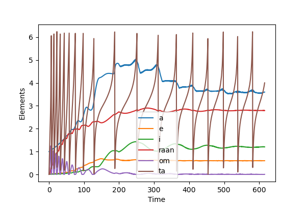
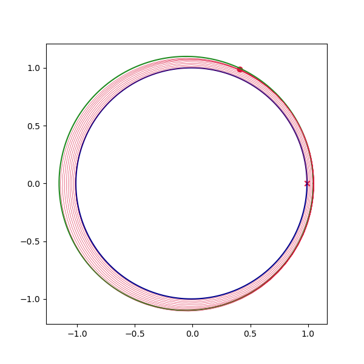
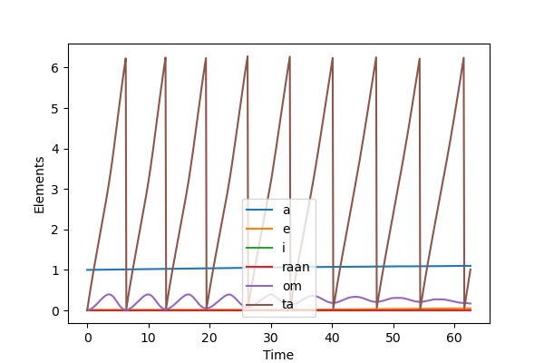
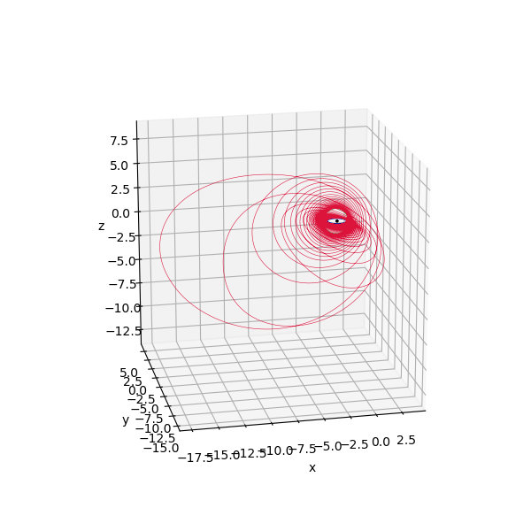
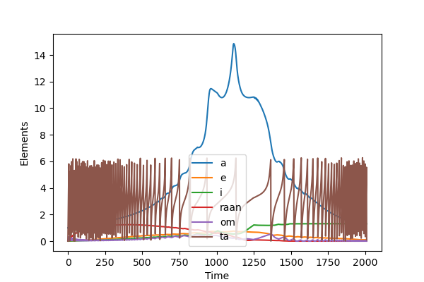
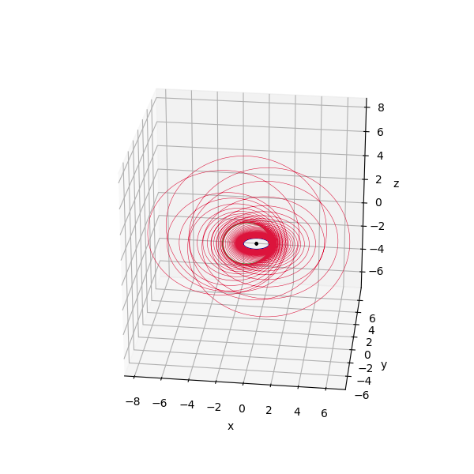
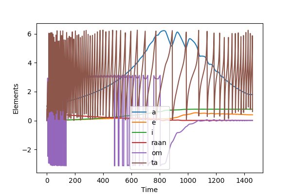

## Interesting transfer combinations


#### Example 0001

```python
# initial and final elements
oe0 = np.array([1.0, 1e-2, 1e-2, 1e-3, 1e-3, 1e-3])
oeT = np.array([3.6, 0.6, 1.2, 2.8, 0.0])
woe = [1.0, 1.0, 1.0, 1.0, 1.0]
# spacecraft parameters
mass0 = 1.0
tmax = 5e-3
mdot = 1e-4
tf_max = 2500.0
t_step = 0.5
```

<p align="center">
  
  
</p>


#### Example 0002

```python
# initial and final elements
oe0 = np.array([1.0, 1e-2, 1e-4, 1e-4, 1e-4, 1e-4])
oeT = np.array([1.1, 0.05, 0.01, 0.0, 0.0])
woe = [1,1,0,0,0]
# spacecraft parameters
mass0 = 1.0
tmax = 1e-3
mdot = 1e-4
tf_max = 100.0
t_step = 0.1
```

<p align="center">
  
  
</p>


#### Example 0003

```python
# initial and final elements: [a,e,i,RAAN,omega,ta]
oe0 = np.array([1.0, 1e-2, 1e-2, 1e-2, 1e-2, 1e-3])
oeT = np.array([1.3, 0.1, np.pi/2.4, 0.0, 0.0])
woe = [1.0, 1.0, 1.0, 1.0, 1.0]
# spacecraft parameters
mass0 = 1.0
tmax = 1e-3
mdot = 1e-4
tf_max = 3000.0
t_step = 1.0
```

<p align="center">
  
  
</p>


#### Example 0003

```python
prob = pyqlaw.QLaw(
    integrator="rk4", 
    elements_type="mee_with_a",
    disable_tqdm=False,
)
# initial and final elements: [a,e,i,RAAN,omega,ta]
oe0 = pyqlaw.kep2mee_with_a(np.array([1.0, 1e-4, 0.0, 1e-2, 1e-2, 1e-3]))
oeT = pyqlaw.kep2mee_with_a(np.array([1.8, 0.4, np.pi/4, 1e-2, 1e-2, 1e-3]))
# initial and final elements: [a,e,i,RAAN,omega,ta]
#oe0_kep = np.array([1.5, 0.2, 0.3, 1e-2, 1e-2, 1e-3])
#oeT_kep = np.array([2.2, 0.3, 1.1, 0.3, 0.0, 0.0])
#oe0 = pyqlaw.kep2mee_with_a(oe0_kep)
#oeT = pyqlaw.kep2mee_with_a(oeT_kep)
woe = [1.0, 1.0, 1.0, 1.0, 1.0]
# spacecraft parameters
mass0 = 1.0
tmax = 1e-3
mdot = 1e-4
tf_max = 3000.0
t_step = 1.0
```

<p align="center">
  
  
</p>
